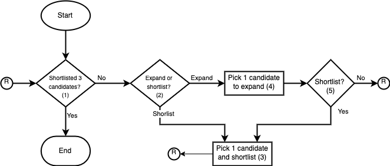

# Interaction Time Series

This repository contains the source code of the software tools (`src/experiment`) 
used to support the design and execution of an experiment to study *how the 
outcomes of job applicants can be affected by ranking algorithms, user interfaces, 
and environmental factors*. 

Also, it includes the source of the tool (`src/synthetic_data_generator`) employed 
to generate the synthetic dataset of interactions. Output of the synthetic data
generator is located inside the directory `gen_output`.

## Synthetic Interactions Generation

The generation of synthetic interactions is based on a model that formalizes the 
sequence of actions taken by users with the recruitment platform developed for 
the experiment.

### Sequence Model

The sequence is composed of five steps. It starts by checking (step 1) whether 
the user has shortlisted the required number of candidates (3 out of a list of 10). 
While the number of shortlisted candidates is less than three, the user decides 
whether to shortlist or expand a candidate (step 2). A candidate is selected if 
the user decides to do an expansion (step 4). By expansion, we mean that the user 
inspects in more detail the candidate profile— abbreviated by default, showing only 
the last professional experience. If the user decides to shortlist a candidate 
(step 2), she picks one from the list of 10 (step 3). After shortlisting a candidate, 
the sequence goes back to step 1. After an expansion, the user decides whether to 
shortlist or not the candidate recently inspected (step 5). If a shortlisting is 
decided, the sequence goes to step 3 otherwise, it continues with step 1. 

Synthetic data are generated by following the flow chart model shown in the figure  
and simulating interactions for each condition (i.e., combinations of the four 
rankings, three cultural fits, and two identification possibilities) and job 
description.

### Model Parameters

Decisions at step 1 are deterministic based on the number of candidates shortlisted. 
However, decisions in steps 2 and 5 are based on probabilities computed on the 
data obtained from the experiment. In particular, the probability of expanding a 
candidate in step 2 is calculated by dividing the number of expansions by the total 
number of actions (including both expansions and shortlisting) that are observable 
in the experimentation data for a given job and condition. Similarly, the probability 
of conducting a shortlist after an expansion (step 5) is defined by the number of 
shortlistings preceded by an expansion divided by three, which is the number of 
shortlistings that occur in each condition and job.

Crucial for computing probabilities of step 5 are the timestamps in which action 
occurred. While expansion timestamps are directly taken from the experiment data, 
shortlisting timestamps were not collected during experimentation but are inferred 
from expansions following the next rules. In cases where candidates were not expanded 
for a given job and condition, shortlisting is assigned a fabricated timestamp, 
taking as reference the date and time of the first expansion that occurred in the 
experiment and observing the shortlisting order, i.e., the first shortlisted candidate 
is assumed to be selected before the second shortlisted candidate, and so on. For 
shortlisted candidates that were expanded, it is assumed that shortlisting happens 
right after the last expansion of the candidates to control for situations in which 
candidates were expanded multiple times. When candidates were shortlisted without 
being expanded, it is assumed their shortlisting happens before other candidates 
are expanded for the first time.

Logistic regression models are fitted to compute the probability of a candidate 
being shortlisted (step 3) or expanded (step 4). One model is developed per each 
condition. Candidates’ fitness, gender, ethnicity, and ranking position for a given 
condition and job are used as the independent variables, while a boolean variable 
representing whether the candidate was shortlisted/expanded as the dependent variable. 
Categorical variables gender and ethnicity (continent) were converted into numerical. 
Gender was converted by assigning 1 to female candidates in jobs with more female shares 
(i.e., nurse, customer service representative, store associate, administrative assistant), 
according to the EU report [Jobs with the highest shares of women in Q3 2022](https://ec.europa.eu/eurostat/web/products-eurostat-news/w/edn-20230308-1), 0 otherwise. 
For the rest of the jobs, 0 was assigned to women while 1 was to men. Ethnicity 
was converted to numeric by assigning 1 to European candidates whereas 0 to non-Europeans. 
Rankings were reverted to be consistent with fitness values, which are higher for 
highly relevant candidates and lower for less relevant candidates.

### Simulating Interactions

A simulation starts by checking whether the required number of candidates were 
already selected. If not, it goes to step 2 where a random number between 0 and 
1 is computed. If the random number is larger than or equal to the probability 
associated with step 2 for a given condition and job, an expansion action is conducted; 
otherwise, the shortlist path is taken.

For shortlisting (step 3) a candidate, we take the list of candidates associated 
with the given condition and job and use the logistic regression model computed 
for the condition to calculate the probabilities of the candidates being selected. 
If no candidate was already shortlisted, the candidate with the highest probability 
is chosen. If one candidate was already shortlisted, the candidate with the second 
highest probability is selected, and so on. After this step the flows continue by 
checking the number of candidates already shortlisted and proceeding from there.

For expanding a candidate (step 4), the list of candidates associated with a 
given condition and job is fed into the logistic regression model calculated for 
the condition to obtain the candidates' probabilities of being selected for an expansion. 
The candidate with the highest probability who was not already shortlisted is selected 
for the expansion. Later, a procedure similar to the one applied in step 2 is conducted 
for the decision in step 5, deciding to shortlist (step 3) if the random number is 
larger than or equal to the shortlisting probability defined for the given condition 
and job. If no shortlisting is conducted, the flow proceeds by checking the number 
of shortlisted candidates, continuing the execution from there.

### Limitations and Future Works

The approach has limitations. First, shortlist timestamps are artificially created 
using the rules presented in the previous section. Here, the experimentation platform 
will be adjusted to store this information, and additional rounds of experiments 
are planned to be conducted to collect the missing information. Second, logistic 
regression models used to decide which candidate to select in a given shortlisting 
or expansion situation weakly adjust the data in some conditions. This situation 
is planned to be improved by conducting feature selection before fitting the models, 
removing independent variables that might be adding noise and are not statistically 
relevant for adjusting the data. Also, more experiment rounds might be conducted 
to collect more data that can help to improve the model performance.

### Dataset of Synthetic Interactions

Using the procedure presented in the previous sections, a dataset of 1200 synthetic 
interactions was generated, including approximately five interaction sequences per 
each combination of conditions and jobs. The synthetic dataset can be found at `gen_output/findhr-synthetic_interactions.zip`. 
The dataset is compressed as a zip file containing a JSON file including the synthetic 
interactions, two CSV files with the probabilities for the decision steps 2 and 5, 
and two CSV files containing information about the logistic regression models used 
in steps 3 and 4.

Future versions of the dataset will include improvements to the limitations discussed 
previously. The final version of the dataset will be available for researchers in 
established EU academic institutions under a license agreement.
